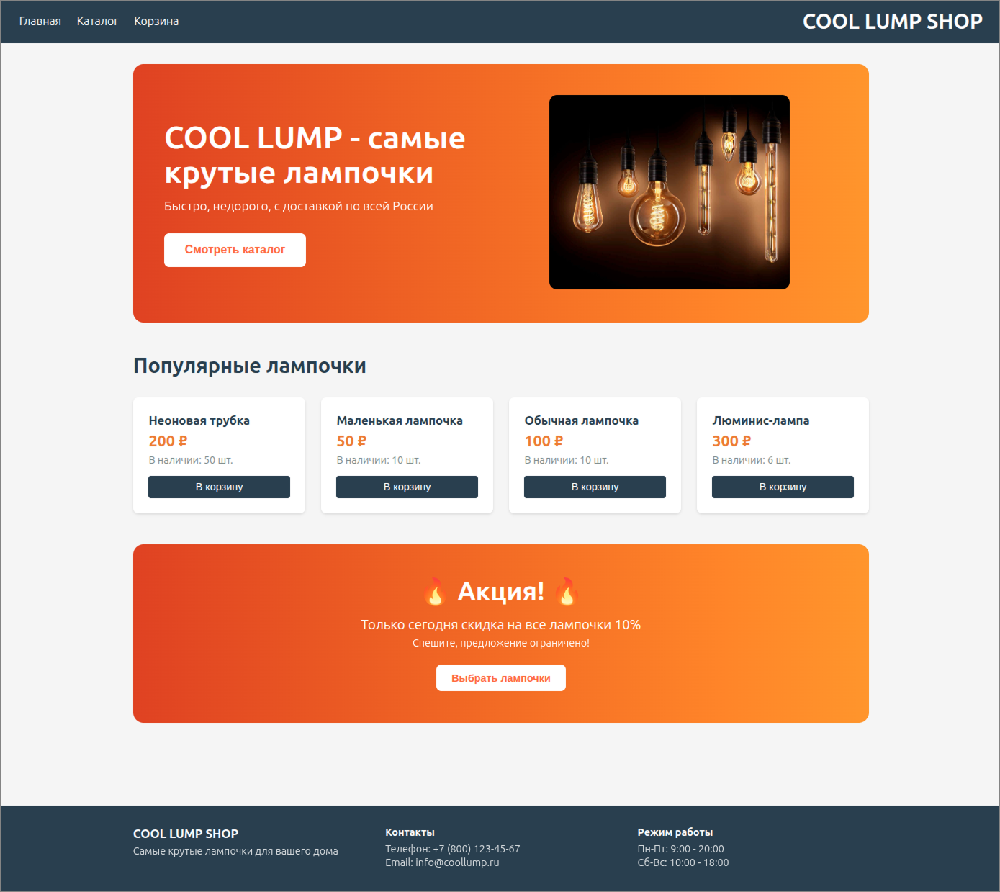

# COOL LUMP SHOP — интернет-магазин лампочек

Интернет-магазин лампочек с микросервисной архитектурой (Goods Service + Orders Service) и React-фронтендом.



---

## Запуск

### 1. Клонируйте репозиторий

```bash
git clone https://github.com/millana4/web_dev_ecommerce_lump.git
cd web_dev_ecommerce_lump
```
### 2. Запустите бэкенд (Docker)

В корневой папке проекта выполните:

```bash
docker compose up --build
```

Будут запущены:

- **Goods Service** — `http://localhost:8001` (управление товарами)
- **Orders Service** — `http://localhost:8002` (управление заказами)
- **PostgreSQL** для каждого сервиса (порты 5433 и 5434)

**Swagger документация:**
- Товары: [http://localhost:8001/docs](http://localhost:8001/docs)
- Заказы: [http://localhost:8002/docs](http://localhost:8002/docs)

### 3. Запустите фронтенд

Откройте **новый терминал** и выполните:

```bash
cd frontend
npm install
npm run dev
```
Фронтенд будет доступен по адресу: http://localhost:5173


## Структура проекта

web_dev_ecommerce_lump/
├── goods_service/ # Микросервис товаров (FastAPI)
├── orders_service/ # Микросервис заказов (FastAPI)
├── frontend/ # React-приложение (Vite)
│ ├── src/ # Исходный код
│ ├── public/images/ # Статические изображения
│ └── ...
├── docker-compose.yml # Оркестрация контейнеров
└── README.md

## Функциональность

- Каталог товаров с фильтрацией по цоколю, форме и типу
- Карточка товара с подробными характеристиками и отзывами
- Корзина с сохранением в `localStorage`
- Оформление заказа с валидацией данных
- Проверка остатков через Goods Service
- Адаптивный дизайн

## Тестовые данные

При первом запуске бэкенда автоматически создаются:

- **Цоколи:** E27, E14, GU10, G4, G9
- **Формы:** Свеча, Груша, Трубка
- **Типы:** LED, накаливания, галогенная, люминесцентная, ксеноновая
- **Поставщики:** 5 штук

## Технологии

**Бэкенд:**
- FastAPI
- PostgreSQL
- SQLAlchemy
- Docker / Docker Compose

**Фронтенд:**
- React 18
- React Router v6
- Axios
- Vite
- CSS Modules

## Примечания

- Для работы фронтенда бэкенд должен быть запущен (CORS уже настроен)
- Корзина сохраняется в браузере (`localStorage`)
- При создании заказа автоматически обновляются остатки товаров